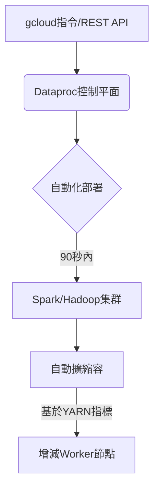

## Google Cloud Dataproc 服務深度解析

Google Cloud Datatproc 是專為大數據處理設計的全託管服務，整合 Apache Spark 和 Hadoop 生態系。以下從技術架構、核心優勢到實戰應用全面解析：

---

### **一、核心架構特性**

#### **分離式儲存設計**

- 使用 Cloud Storage 取代傳統 HDFS，實現**儲存與計算分離**
- 資料持久性不受集群生命週期影響，支援跨集群重複使用資料[^3][^6]
- 典型資料流：Cloud Storage → Dataproc 處理 → BigQuery/Bigtable 儲存結果


#### **集群管理機制**




---

### **二、六大核心優勢**

| 優勢維度 | 技術實現 | 商業價值 | 來源 |
| :-- | :-- | :-- | :-- |
| **成本效益** | 按秒計費 + 預空置VM最高省80%成本 + 自動關閉閒置集群 | 較自建Hadoop節省60%以上運維成本 | [^2][^1] |
| **極速部署** | 利用Google全球骨幹網，90秒內完成集群啟動 | 突發流量處理效率提升3-5倍 | [^1][^4] |
| **無縫整合** | 原生支援BigQuery ML、Vertex AI、Dataflow等35+ GCP服務 | 構建完整數據管道只需API調用 | [^3][^4] |
| **版本控制** | 預構建映像檔支援Hadoop 3.3/Spark 3.4等20+版本，可自定義Docker映像 | 無需擔心版本衝突，輕鬆實現技術棧升級 | [^5][^1] |
| **智能擴縮容** | 基於YARN內存使用率自動調整Worker數量，支援0到N節點彈性伸縮 | 資源利用率提升40%，作業完成時間縮短30% | [^4][^1] |
| **企業級監控** | 內建Stackdriver日誌與指標，支援自定義告警規則 | 問題定位時間從小時級縮短至分鐘級 | [^2][^6] |


---

### **三、進階應用場景**

#### **1. 日誌分析流水線**

```bash
# 創建臨時集群執行日誌ETL
gcloud dataproc clusters create log-etl \
    --region=asia-east1 \
    --single-node \
    --image-version=2.1 \
    --metadata='PIP_PACKAGES=apache-beam[gcp]==2.46.0' \
    --initialization-actions=gs://goog-dataproc-initialization-actions-asia-east1/python/pip-install.sh
```

- 從Cloud Storage讀取原始日誌
- 使用Spark SQL進行清洗與聚合
- 輸出結果至BigQuery供BI工具使用[^3][^6]


#### **2. 機器學習特徵工程**

```python
from pyspark.ml.feature import VectorAssembler
from pyspark.sql import SparkSession

spark = SparkSession.builder.appName("feature-engineering").getOrCreate()
df = spark.read.parquet("gs://my-bucket/raw-data/")

assembler = VectorAssembler(
    inputCols=["age", "income", "purchase_freq"],
    outputCol="features"
)
processed = assembler.transform(df)
processed.write.parquet("gs://my-bucket/processed-data/")
```

- 整合MLflow進行實驗追蹤
- 輸出特徵至Vertex AI進行模型訓練[^4]


#### **3. 串流數據處理**

- 使用Spark Structured Streaming消費Pub/Sub數據
- 即時計算指標並寫入Cloud Bigtable
- 搭配Dataproc Serverless無需管理集群[^4]

---

### **四、與傳統方案的技術對比**

| 項目 | 自建Hadoop集群 | Google Dataproc |
| :-- | :-- | :-- |
| 部署時間 | 2-4小時 | <90秒 |
| 擴容操作 | 手動添加節點，需重啟服務 | 自動無縫擴容，不影響運行中作業 |
| 版本升級 | 需停機維護，兼容性風險高 | 創建新集群即切換版本，舊集群並行測試 |
| 容錯機制 | 需自行配置HDFS副本與YARN重試 | 自動節點更換+Cloud Storage持久化 |
| 監控系統 | 需部署額外監控組件（如Prometheus） | 原生整合Stackdriver，開箱即用 |


---

### **五、最佳實踐建議**

1. **儲存策略**
    - 使用`gs://`路徑替代HDFS，實現跨集群資料共享
    - 啟用Cloud Storage版本控制防止誤刪
2. **成本優化**
    - 混合使用常規VM與preemptible實例（最高節省80%）
    - 設定集群自動刪除策略（--max-idle參數）
3. **安全加固**
    - 使用VPC Service Controls限制資料出口
    - 啟用Dataproc機密VM功能加密內存數據
4. **效能調校**
    - 根據作業類型選擇最佳機器類型（記憶體優化/計算優化）
    - 調整YARN配置參數（yarn.nodemanager.resource.memory-mb）

---

### **總結**

Google Dataproc 透過全託管服務與深度GCP整合，重新定義了大數據處理範式。其分離式架構打破傳統Hadoop限制，配合秒級伸縮與精細成本控制，使企業能專注於數據價值萃取而非基礎設施維運。無論是臨時性ETL任務或常駐型串流處理，皆能透過統一平台高效實現。

<div style="text-align: center">⁂</div>

[^1]: https://cloud.google.com/dataproc/docs/concepts/overview

[^2]: https://eitca.org/cloud-computing/eitc-cl-gcp-google-cloud-platform/gcp-labs/apache-spark-and-hadoop-with-cloud-dataproc/examination-review-apache-spark-and-hadoop-with-cloud-dataproc/what-are-the-key-advantages-of-using-cloud-dataproc-for-running-spark-and-hadoop/

[^3]: https://blog.clairvoyantsoft.com/what-is-google-dataproc-and-how-does-it-work-2ace652b0408?gi=8e78c1786e20

[^4]: https://www.chaosgenius.io/blog/google-cloud-dataproc-vs-databricks/

[^5]: https://cloud.google.com/dataproc/docs/concepts/services

[^6]: https://luminousmen.com/post/things-to-consider-while-running-google-cloud-dataproc/

[^7]: https://cloud.google.com/resources/analyzing-economic-benefits-of-dataproc-whitepaper

[^8]: https://codelabs.developers.google.com/codelabs/cloud-dataproc-gcloud

[^9]: https://cloud.google.com/dataproc

[^10]: https://cloud.google.com/dataproc/docs/resources/faq

[^11]: https://www.33rdsquare.com/google-dataproc-functionalities-and-use-cases/

[^12]: https://index.scala-lang.org/googleclouddataproc/spark-bigquery-connector

[^13]: https://console.cloud.google.com/marketplace/product/google-cloud-platform/cloud-dataproc

[^14]: https://www.cloudskillsboost.google/paths/11/course_templates/178/video/463321?locale=zh_TW

[^15]: https://de.wikipedia.org/wiki/Google_Cloud_Dataproc

[^16]: https://www.youtube.com/watch?v=h1LvACJWjKc

[^17]: https://www.youtube.com/watch?v=9zhtwwTZnNA

[^18]: https://www.googlecloudcommunity.com/gc/Data-Analytics/Dataproc-variants-Pros-Cons-and-Usecases/m-p/806517

[^19]: https://www.whizlabs.com/blog/cloud-dataproc-vs-cloud-dataflow/

[^20]: https://dev.to/jader_lima_b72a63be5bbddc/loading-data-to-google-big-query-using-dataproc-workflow-templates-and-cloud-schedule-4l4

