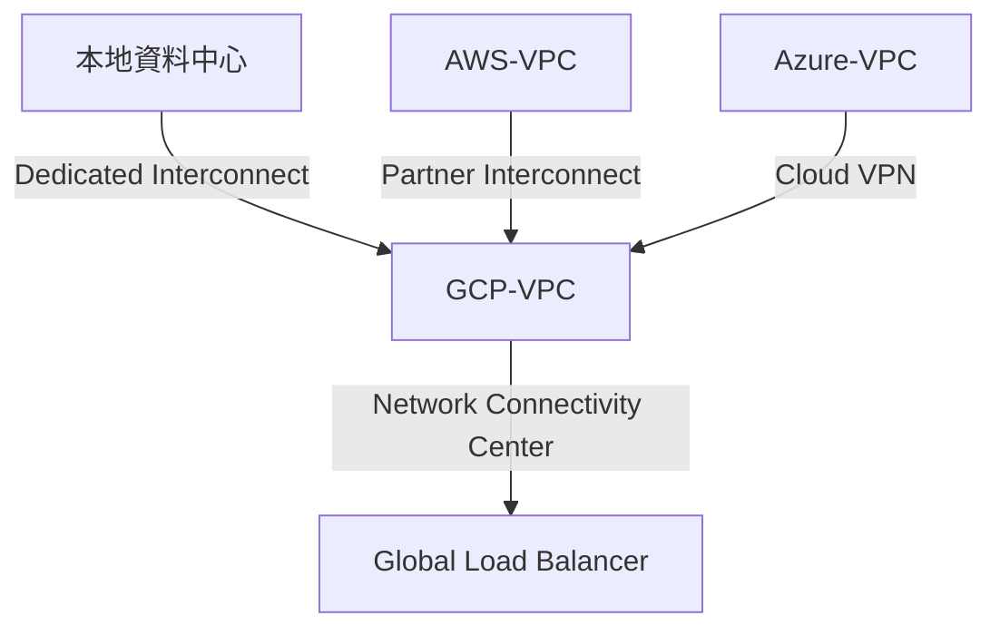

## Google Cloud 混合雲連線方案全解析

在混合雲架構中，Google Cloud 提供多種方案實現 VPC 與本地資料中心或其他雲端的連接。以下整理四大主流方案與技術細節：

---

### **一、混合雲連線方案比較**

| 方案 | 傳輸媒介 | 最大頻寬 | SLA | 適用場景 | 參考來源 |
| :-- | :-- | :-- | :-- | :-- | :-- |
| Cloud VPN | 公共網際網路 | 3 Gbps/隧道 | 無 | 臨時連線、測試環境、低頻寬需求 | [^1][^5] |
| Direct Peering | 專線對接 | 10 Gbps | 無 | 高吞吐量但無SLA要求的企業連線 | [^2] |
| Dedicated Interconnect | 專用光纖 | 80 Gbps | 99.99% | 任務關鍵型生產系統 | [^3][^5] |
| Partner Interconnect | 合作夥伴網路 | 10 Gbps | 99.99%* | 無法直連Google設施的跨區域連線 | [^4][^6] |

> *需符合Google推薦拓撲架構，且依賴合作夥伴可靠性 [^4]

---

### **二、核心方案技術解析**

#### **1. Cloud VPN（虛擬私有網路）**

- **運作原理**：透過IPsec隧道加密流量，在公共網路上建立安全通道
- **動態路由**：需搭配 **Cloud Router** 使用 BGP 協議交換路由資訊[^7]

```bash
# 建立Cloud Router實例
gcloud compute routers create vpn-router \
    --network=vpc-network \
    --region=asia-east1 \
    --asn=64512
```

- **優勢**：成本低、快速部署、支援跨雲連線
- **限制**：延遲不穩定，適用於非即時性數據同步


#### **2. Direct Peering（直接對等）**

- **架構特性**：
    - 在Google PoP點直接部署客戶路由器[^2]
    - 無需經過公網，降低延遲
    - 支援 **MACsec** 加密（需硬體支援）
- **適用場景**：大數據傳輸、媒體串流服務
- **注意事項**：需自行管理物理線路維護


#### **3. Dedicated Interconnect（專用互連）**

- **高可用設計**：
    - 至少2條跨不同可用區的10Gbps連接可達99.99% SLA[^3]
    - 建議搭配 **Cloud HA VPN** 實現故障切換
- **流量計費**：僅收取出口流量費，無資料傳輸費
- **實例配置**：

```bash
# 建立專用互連連接
gcloud compute interconnects create dc-connection \
    --location=us-central1 \
    --admin-enabled \
    --link-type=LINK_TYPE_10G_LR
```


#### **4. Partner Interconnect（合作夥伴互連）**

- **部署流程**：

1. 選擇支援的服務提供商（如Equinix、AT\&T）[^4]
2. 建立VLAN附件並配置BGP會話
3. 啟用 **Network Connectivity Center** 集中管理多點連線[^5]
- **分層服務**：
    - **Layer 2**：客戶自行管理BGP配置
    - **Layer 3**：由合作夥伴處理路由交換

---

### **三、進階混合架構設計**

#### **多雲容災架構示例**




#### **關鍵技術組合**

- **混合DNS**：使用Cloud DNS Private Zones統一管理跨雲域名解析
- **流量分級**：透過 **QoS 標籤** 優先保障關鍵業務流量
- **安全加固**：
    - 啟用 **VPC Flow Logs** 監控異常流量
    - 使用 **Cloud Armor** 防護DDoS攻擊

---

### **四、選型決策樹**

1. **是否需要SLA保障？**
    - 是 → Dedicated/Partner Interconnect
    - 否 → 考慮Cloud VPN或Direct Peering
2. **頻寬需求是否超過3Gbps？**
    - 是 → 選擇專線方案（Interconnect）
    - 否 → Cloud VPN經濟實惠
3. **是否已有合作夥伴網路合約？**
    - 是 → Partner Interconnect快速整合
    - 否 → 評估自建專線成本

---

### **總結**

選擇混合雲連線方案需綜合評估頻寬、延遲、成本與合規要求。對於關鍵業務系統，建議採用雙專線+VPN備援架構，並透過Network Connectivity Center實現統一管理。技術實施時需注意BGP路由優化與安全策略的細粒度控制。

<div style="text-align: center">⁂</div>

[^1]: https://cloud.google.com/hybrid-connectivity

[^2]: https://cloud.google.com/network-connectivity/docs/direct-peering

[^3]: https://cloud.google.com/network-connectivity/docs/interconnect/sla.md

[^4]: https://cloud.google.com/blog/products/gcp/partner-interconnect-now-generally-available

[^5]: https://cloud.google.com/architecture/network-hybrid-multicloud

[^6]: https://tutorialsdojo.com/google-cloud-hybrid-connectivity/

[^7]: https://tutorialsdojo.com/google-cloud-router/

[^8]: https://jayendrapatil.com/google-cloud-hybrid-connectivity/

[^9]: https://www.cloudskillsboost.google/course_templates/1145

[^10]: https://www.googlecloudcommunity.com/gc/Infrastructure-Compute-Storage/Hybrid-On-prem-connectivity-options-to-GCP-Partner-Interconnect/m-p/831286

