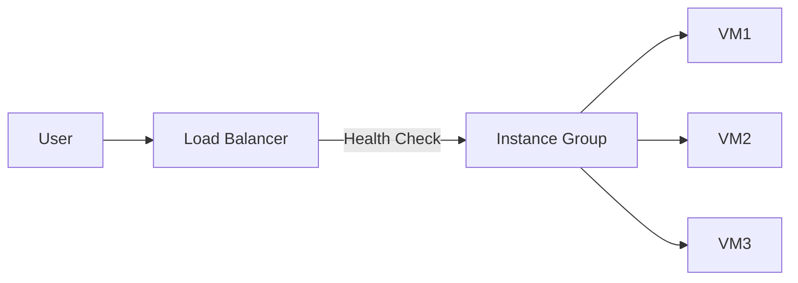

## Google Cloud 總整課程筆記

### **一、服務水平核心概念**

| 術語 | 定義 | 關鍵點 |
| :-- | :-- | :-- |
| **SLI** | Service Level Indicator | 量化指標（如可用性、延遲） |
| **SLO** | Service Level Objective | 服務目標值（如99.9%可用性） |
| **SLA** | Service Level Agreement | 違反目標的補償協議 |


---

### **二、雲端四大核心功能**

1. **Compute**：運算資源管理（VM、容器）
2. **Storage**：數據儲存方案
3. **Big Data**：大規模數據處理
4. **Machine Learning**：AI模型開發與部署

---

### **三、資源層級架構**

```markdown
Organization
├─ Folder
   ├─ Project
      ├─ Resource (VM/Bucket等)
```

- **非人類操作**：使用 Service Account 替代個人帳號
- **IAM 角色類型**：
    - Primitive：基本權限（Owner/Editor/Viewer）
    - Pre-defined：服務專用權限（如Storage Admin）
    - Custom：自定義權限組合

---

### **四、據點與存取方式**

#### **全球架構**

- **Region**：地理區域（如asia-east1）
    - 包含多個 **Zone**（隔離的故障域）
- **Edge Location**：非Google機房的網路接入點


#### **存取工具**

```bash
# 常用 CLI 工具
gcloud       # 通用指令
gsutil       # Cloud Storage 操作
bq           # BigQuery 查詢
```


---

### **五、Compute 服務解析**

#### **Compute Engine（IaaS）**

- 自選硬體配置（CPU/RAM/OS）
- **Snapshot** 用途：
    - 災難復原
    - 跨硬碟/VM資料遷移


#### **容器化技術**

| 元件 | 功能 |
| :-- | :-- |
| **Container** | 封裝應用與依賴的輕量虛擬化環境 |
| **Cloud Build** | 自動建置 Docker 映像檔 |
| **Artifact Registry** | 儲存/管理映像檔版本庫 |

#### **Kubernetes（GKE）**

- 自動管理容器叢集
- 根據負載自動擴縮節點

---

### **六、網路架構（VPC）**

#### **核心特性**

- 跨 Region 內部 IP 直連
- **防火牆規則**：
    - 分入站/出站獨立設定
    - 使用標籤批量套用規則


#### **負載平衡設計**



- **自動擴展**：依流量自動增減 VM 數量
- **健康檢查**：定期探測實例狀態

---

### **七、儲存方案比較**

| 類型 | 代表服務 | 適用場景 |
| :-- | :-- | :-- |
| **關聯式資料庫** | Cloud SQL | 結構化數據、事務處理 |
| **非關聯式資料庫** | Firestore | 彈性Schema、即時同步 |
| **物件儲存** | Cloud Storage | 多媒體文件、版本控制 |
| **資料倉儲** | BigQuery | PB級分析、SQL查詢 |

#### **Cloud Storage 資費方案**

- **Standard**：高頻存取
- **Nearline**：每月存取≤1次
- **Coldline**：每年存取≤1次
- **Archive**：極低頻存取（≥1年）

---

### **八、BigQuery 架構優勢**

- **分散式儲存**：自動分片數據
- **列式儲存**：優化分析查詢速度
- **即時串流**：支援每秒百萬級數據插入

---

### **九、安全與權限最佳實踐**

1. **最小權限原則**：僅授予必要權限
2. **資源隔離**：每個團隊獨立 Project
3. **加密預設**：靜態數據自動加密
4. **日誌審計**：啟用 Cloud Audit Logs

---

此筆記整合雲端核心概念與實務應用，適合作為考前複習或日常查閱參考。

