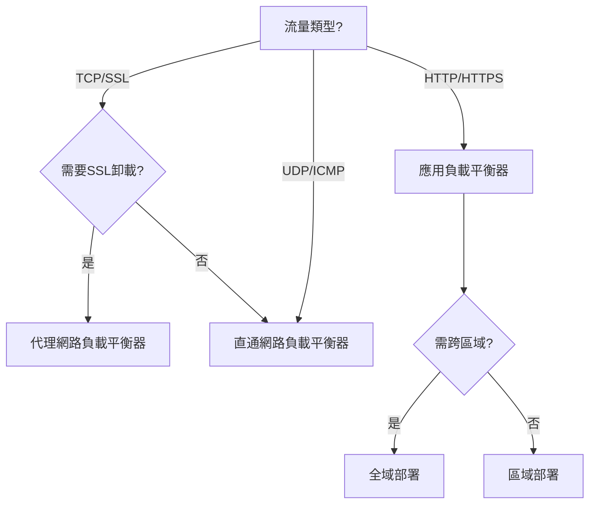

## Google Cloud 負載平衡方案全解析

Google Cloud 的負載平衡服務能自動分配流量、提升應用可用性，並支援多種協議與部署模式。以下是主要類型與選型指南：

---

### **一、核心功能與優勢**

- **全託管服務**：無需管理基礎設施，自動擴展應對流量高峰[^5][^4]
- **跨區域容災**：自動檢測後端健康狀態，實現多區域故障轉移[^4][^5]
- **協議全面支援**：涵蓋 HTTP(S)、TCP、UDP、SSL 等協議[^3][^4]
- **無需預熱**：可瞬間從零擴展到全流量，適合突發流量場景[視頻內容]

---

### **二、負載平衡器類型比較**

| 類型 | 層級 | 主要協議 | 關鍵功能 | 適用場景 | 來源 |
| :-- | :-- | :-- | :-- | :-- | :-- |
| **應用負載平衡器** | L7 | HTTP/HTTPS | URL路徑路由、SSL終止、Cookie親和性 | Web應用、微服務API | [^1][^6] |
| **代理網路負載平衡器** | L4 | TCP/SSL | 全域負載、SSL卸載、進階流量管理 | 需SSL加速的TCP服務 | [^2][^3] |
| **直通網路負載平衡器** | L4 | TCP/UDP/ICMP | 保留客戶端IP、支援非標準協議 | 遊戲伺服器、VoIP、IoT設備 | [^2][^4] |
| **內部HTTP(S)負載平衡器** | L7 | HTTP/HTTPS | 內部服務路由、跨區域流量分配 | 微服務內部通訊、多集群管理 | [^6][^4] |


---

### **三、選型決策流程**




---

### **四、配置範例：建立全域HTTP負載平衡器**

```bash
# 建立後端服務
gcloud compute backend-services create web-backend \
    --protocol=HTTP \
    --port-name=http \
    --global

# 建立URL地圖
gcloud compute url-maps create web-map \
    --default-service web-backend

# 建立目標代理
gcloud compute target-http-proxies create http-proxy \
    --url-map web-map

# 建立全域轉發規則
gcloud compute forwarding-rules create http-rule \
    --global \
    --target-http-proxy=http-proxy \
    --ports=80
```

*程式碼來源：官方文件[^6]*

---

### **五、進階功能與最佳實踐**

1. **SSL終止**：在負載平衡器層處理加密，減輕後端伺服器負擔[^1][^6]
2. **會話親和性**：使用Cookie或IP雜湊保持用戶連線一致性[^6][^5]
3. **分級健康檢查**：設定HTTP/HTTPS/TCP檢查間隔與失敗閾值[^4]
4. **CDN整合**：搭配Cloud CDN快取靜態內容，降低延遲[^1][^5]
5. **日誌與監控**：啟用Cloud Logging與Monitoring追蹤流量模式[^3]

---

### **六、費用與層級選擇**

| 網路服務層級 | 特性 | 適用場景 |
| :-- | :-- | :-- |
| **Premium** | 全球任播IP、IPv6支援、最高SLA | 跨國企業、高可用性要求系統 |
| **Standard** | 區域IP、基礎功能、成本較低 | 單區域部署、預算有限專案 |

> 建議：關鍵業務使用Premium層級，測試環境可選Standard[^1][^3]

---

### **總結**

根據流量類型、協議需求與架構複雜度選擇合適的負載平衡器。應用層負載平衡器適合Web服務，網路層方案則更適用於協議定制化場景。結合自動擴展與健康檢查，可構建高可用、彈性的雲端架構。

<div style="text-align: center">⁂</div>

[^1]: https://cloud.google.com/load-balancing/docs/choosing-load-balancer

[^2]: https://cloud.google.com/blog/products/networking/choosing-a-network-load-balancer-in-google-cloud

[^3]: https://blog.cloud-ace.tw/networking-website/load-balance/load-balancing-types/

[^4]: https://cloud.google.com/load-balancing/docs/load-balancing-overview

[^5]: https://www.appsecengineer.com/blog/enhance-your-application-infrastructure-with-google-clouds-load-balancer

[^6]: https://cloud.google.com/load-balancing/docs/application-load-balancer

[^7]: https://www.vmware.com/topics/google-cloud-load-balancer

[^8]: https://cloud.google.com/load-balancing/docs/features

[^9]: https://ikala.cloud/blog/infrastructure/gcp-aws-load-balancing-comparison

[^10]: https://docs.appdynamics.com/fso/cloud-native-app-obs/en/cloud-and-infrastructure-monitoring/google-cloud-platform-observability/observe-google-cloud-platform-entities/gcp-load-balancers/gcp-passthrough-network-load-balancers

[^11]: https://stackoverflow.com/questions/41535226/what-are-the-differences-between-network-and-https-load-balancer-in-gcp

[^12]: https://tutorialsdojo.com/google-cloud-load-balancing/

[^13]: https://cloud.google.com/use-cases/load-balancing

[^14]: https://www.cloudcastcomputing.com/google-cloud-load-balancing

[^15]: https://cyfuture.cloud/kb/load-balancer/how-load-balancer-works-in-gcp

[^16]: https://cloudkul.com/blog/google-cloud-load-balancing-types-region-pricing-feature/

[^17]: https://www.googlecloudcommunity.com/gc/Infrastructure-Compute-Storage/Difference-between-ALB-and-NLB-in-connection-reusing-aspect/m-p/836794

[^18]: https://www.cloudoptimo.com/blog/an-overview-of-aws-load-balancers-best-practices-and-use-cases/

