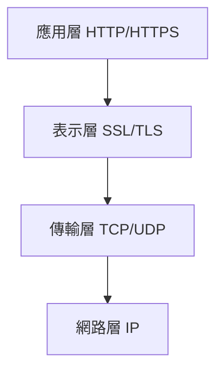
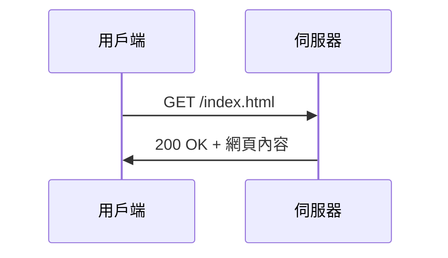
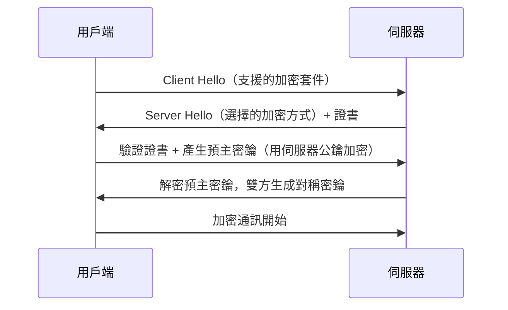
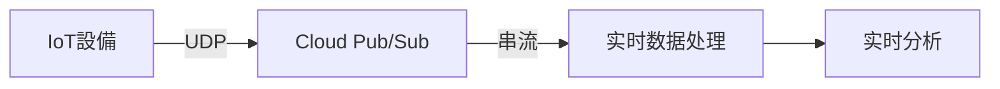
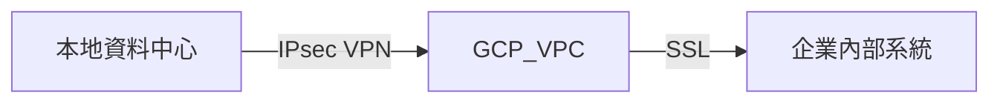

# TCP/UDP，HTTP，ＳＳＬ等等名詞我都沒學過，可以介紹他們和相關概念嗎

以下是 TCP、UDP、HTTP、SSL 等網路協定的基礎解析，搭配圖表與應用場景說明，方便您快速掌握這些核心概念：

---

### **一、網路協定分層架構（OSI 模型）**



- **應用層**：直接與使用者互動（如網頁瀏覽）
- **傳輸層**：負責資料傳輸的可靠性與效率
- **網路層**：處理 IP 位址與路由

---

### **二、TCP vs UDP 核心對比**

| 特性 | TCP（傳輸控制協定） | UDP（使用者資料包協定） |
| :-- | :-- | :-- |
| **連線方式** | 需先建立連線（三次握手） | 無需連線，直接發送資料包 |
| **可靠性** | 保證資料順序與完整性，自動重傳遺失封包 | 不保證送達，可能丟失或亂序 |
| **速度** | 較慢（需確認機制） | 極快（無確認開銷） |
| **適用場景** | 網頁瀏覽、檔案傳輸、電子郵件 | 即時通訊、線上遊戲、影音串流 |
| **Google Cloud 應用** | Cloud SQL、持久化資料庫連線 | Cloud CDN、IoT 裝置數據收集 |


---

### **三、HTTP（超文本傳輸協定）**

#### **基礎特性**

- **請求-回應模型**：



- **無狀態協議**：每次請求獨立，需 Cookie/Session 維持狀態
- **版本演進**：
    - **HTTP/1.1**：持久連線、管道化請求
    - **HTTP/2**：多工傳輸、頭部壓縮
    - **HTTP/3**：基於 UDP 的 QUIC 協議，減少延遲


#### **常見方法**

| 方法 | 用途 |
| :-- | :-- |
| GET | 獲取資源 |
| POST | 提交資料 |
| PUT | 更新完整資源 |
| DELETE | 刪除資源 |


---

### **四、SSL/TLS（安全通訊層協定）**

#### **核心功能**

- **加密傳輸**：防止數據被竊聽
- **身份驗證**：透過數位證書確認伺服器身份
- **資料完整性**：防止傳輸過程被篡改


#### **握手流程**




#### **HTTPS 實作**

- HTTP over SSL/TLS
- 標準端口 443（HTTP 為 80）
- 在 Google Cloud 中可透過：
    - **Load Balancer** 終止 SSL
    - **Certificate Manager** 管理憑證

---

### **五、雲端應用案例**

#### **1. 網站架構（HTTP + TCP）**

```mermaid
graph LR
  用戶 -->|HTTPS| LB[Global HTTP(S) Load Balancer]
  LB -->|TCP| VM1[Web Server]
  LB -->|TCP| VM2[Web Server]
```

- 負載平衡器處理 SSL 終止，後端伺服器專注業務邏輯


#### **2. 即時監控系統（UDP）**



- 使用 UDP 避免 TCP 重傳造成的延遲


#### **3. 混合雲安全連線（SSL VPN）**



- 透過 Cloud VPN 建立加密通道

---

### **六、重點整理表**

| 概念 | 核心特性 | 雲端應用場景 | 相關 GCP 服務 |
| :-- | :-- | :-- | :-- |
| **TCP** | 可靠連線、順序傳輸 | 資料庫連線、文件傳輸 | Cloud SQL、Compute Engine |
| **UDP** | 低延遲、容忍丟包 | 即時串流、IoT 數據收集 | Cloud CDN、Pub/Sub |
| **HTTP** | 網頁基礎、無狀態請求 | Web 服務、API 通訊 | App Engine、Cloud Run |
| **SSL** | 加密傳輸、身份驗證 | 安全連線、合規性保障 | Certificate Manager、LB |


---

這些協定是現代網路與雲端服務的基石，理解其原理能幫助您更有效設計雲端架構。在 Google Cloud 中，這些協定通常已由託管服務自動處理（如 Load Balancer 自動處理 TLS），但掌握底層機制對故障排除與效能優化至關重要。

<div style="text-align: center">⁂</div>

[^1]: https://en.wikipedia.org/wiki/Transmission_Control_Protocol

[^2]: https://www.cloudns.net/blog/udp-user-datagram-protocol-explained-in-details/

[^3]: https://en.wikipedia.org/wiki/HTTP

[^4]: https://sitechecker.pro/what-is-ssl-protocol/

[^5]: https://nordvpn.com/blog/tcp-or-udp-which-is-better/

[^6]: https://www.techtarget.com/whatis/definition/HTTP-Hypertext-Transfer-Protocol

[^7]: https://www.ionos.com/digitalguide/server/know-how/introduction-to-tcp/

[^8]: https://intronetworks.cs.luc.edu/current/uhtml/tcpA.html

[^9]: https://www.fortinet.com/resources/cyberglossary/tcp-ip

[^10]: https://www.khanacademy.org/a/transmission-control-protocol--tcp

