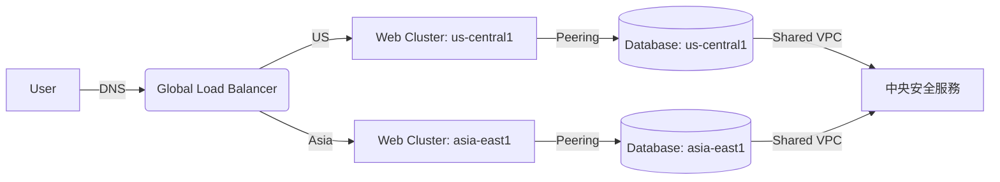

## 多 VPC 網路架構設計：VPC Peering 與 Shared VPC 實戰指南

在大型企業雲端架構中，常需透過多個 VPC 實現資源隔離與協作。以下是兩種主流跨 VPC 連線方案的深度解析與實作建議：

---

### **一、VPC Peering（對等互連）**

#### **核心特性**

- **點對點直連**：兩個 VPC 間建立私有通道，流量透過 Google 骨幹網傳輸（不經公網）
- **無需共用專案**：可跨不同組織/專案建立，雙方各自管理防火牆與路由
- **CIDR 不可重疊**：互連的 VPC 必須使用不同 IP 範圍（如 10.0.0.0/16 與 192.168.0.0/24）


#### **配置流程**

```bash
# 在專案A建立對等連線
gcloud compute networks peerings create peer-ab \
    --network=vpc-a \
    --peer-project=project-b \
    --peer-network=vpc-b

# 在專案B接受連線
gcloud compute networks peerings create peer-ba \
    --network=vpc-b \
    --peer-project=project-a \
    --peer-network=vpc-a
```


#### **適用場景**

- 跨團隊專案協作（如開發環境連測試環境）
- 併購企業間的系統整合
- 多區域部署需低延遲互連（如遊戲伺服器與資料庫分離）

---

### **二、Shared VPC（共用 VPC）**

#### **核心特性**

- **中心化管理**：指定一個宿主專案（Host Project）集中管理網路資源
- **精細權限控制**：透過 IAM 角色（如 `roles/compute.networkUser`）控制服務專案存取
- **資源共享**：服務專案中的 VM 可直接使用宿主 VPC 的子網/防火牆規則


#### **架構配置**

1. 啟用宿主專案的 Shared VPC 功能：

```bash
gcloud compute shared-vpc enable project-host
```

2. 將服務專案附加到宿主 VPC：

```bash
gcloud compute shared-vpc associated-projects add project-service \
    --host-project project-host
```


#### **適用場景**

- 企業中央 IT 管理網路基礎設施
- 微服務架構中多團隊共用核心網路
- 合規要求嚴格的金融/醫療系統

---

### **三、方案比較與選擇指南**

| 比較維度 | VPC Peering | Shared VPC |
| :-- | :-- | :-- |
| 管理模式 | 分散式 | 集中式 |
| 跨組織支援 | 支援 | 僅限同組織內 |
| 網路疊構限制 | 不可形成環狀拓撲（需星型架構） | 無限制，天然中心化結構 |
| 成本結構 | 按傳輸資料量計費 | 無額外連線費，僅標準資源費用 |
| 典型應用場景 | 臨時性跨專案協作 | 長期穩定的多專案架構 |
| 權限控制粒度 | 依專案層級控管 | 可精確到子網/服務帳號層級 |


---

### **四、進階混合架構設計**

#### **情境**：跨區域容災系統

1. 在 `us-central1` 與 `asia-east1` 各建立 VPC（Peering 互連）
2. 使用 Shared VPC 讓各地區專案共用核心安全組件（如防火牆/NAT 閘道）
3. 透過 Cloud Load Balancing 實現跨區域流量分配

#### **流量路徑範例**：




---

### **五、最佳實踐與注意事項**

- **CIDR 規劃**：預留足夠 IP 空間，避免未來擴充衝突
- **安全加固**：
    - 在 Peering 連線中啟用 **VPC Flow Logs** 監控異常流量
    - 使用 **組織政策約束** 限制可連線的 VPC 範圍
- **混合部署**：可同時使用 Peering + Shared VPC 實現分層管理
- **效能優化**：對於高頻傳輸場景，搭配 **Cloud Interconnect** 專線提升吞吐量

---

### **總結**

選擇 VPC Peering 或 Shared VPC 需評估組織結構、權責分工與長期擴展需求。前者適合靈活的點對點連線，後者則為大型企業提供集中化網路治理基礎。實際部署時常混合使用，並搭配 Google Cloud 的全球骨幹網與進階安全服務，構建兼具彈性與穩定性的雲端網路。

